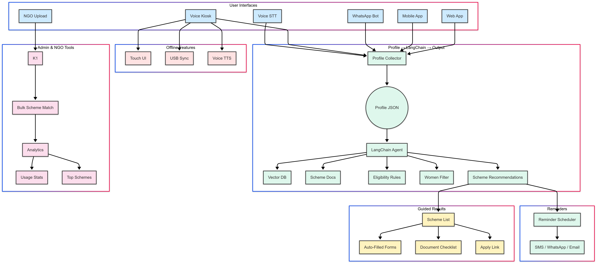

# SahyogBot: Simplifying Access to Government Schemes Through AI

## Our Mission
We introduce **SahyogBot** — an AI-driven assistant dedicated to bridging the gap between citizens and public welfare, with a special focus on empowering students, parents, and underserved communities through accessible, personalized support.

---

## Team Name
**SuvidhaSaathi**

## Problem Statement
**AI-Powered chatbot for government schemes and financial aid**

## Project Title
**SahyogBot**

---

## Brief Project Description

**SahyogBot** is a modular, AI-powered backend system that helps citizens discover government schemes tailored to their profile. Using user attributes (age, gender, location, income), it queries indexed scheme documents and returns a personalized recommendation with a downloadable PDF summary. It uses LangChain and IBM watsonx.ai for LLM interaction and ChromaDB for vector-based retrieval.

---

## Technologies Used

- **FastAPI** – backend framework  
- **LangChain** – LLM prompt chaining and document QA  
- **IBM watsonx.ai** – LLM model provider  
- **ChromaDB** – vector store for semantic search  
- **PyMuPDF (fitz)** – PDF parsing and generation  
- **Markdown2** – markdown formatting  
- **Uvicorn** – ASGI server  
- **Python** – core language  

---

## Setup & Run Instructions

1. Clone the repository:
   ```bash
   git clone https://github.com/SuvidhaSathi/SahyogBot.git
   cd SahyogBot
   ```
2. Install required dependencies:

```bash
pip install -r requirements.txt
```
3. Configure your environment:

- Create a .env file with:
```bash
IBM_WATSON_API_KEY=your_key
IBM_MODEL_ID=meta-llama/llama-3-70b-instruct
```
4. Add scheme PDFs into the docs/ folder.

4. Run the backend:

```bash
uvicorn app.main:app --reload
```
### System Design Diagram
<p align="center">
  
</p>

## Demo Video
📽️ Watch Demo
([Please Increase the Volume as it has some audio issues](https://drive.google.com/file/d/1NfirvIfZNfsFkqSmDWrSUKDqnCvFd_Ly/view?usp=sharing))
